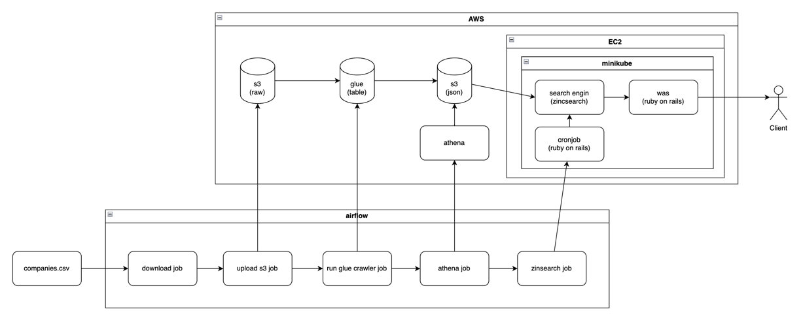

# Visa sponsor company list

## Architecture


## Modules
- [Airflow](./airflow/README.md)
- [Notebook](./notebook/README.md)
- [Search](./search/README.md)
- [Web](./web/README.md)

## Environment Setup
1. airflow
    - `.kube`
    - `.env`
    - `kube_config`
2. nginx
   - `minikube`

## Minikube Dashboard
1. run dashboard
```bash
minikube dashboard --url
```
2. open proxy tunnel 
```bash
ssh -i [private_key.pem] -L [local_port]:localhost:[remote_port] [username]@[remote_host]
```
3. access to proxy url
```bash
http://127.0.0.1:37469/api/v1/namespaces/kubernetes-dashboard/services/http:kubernetes-dashboard:/proxy/ 
```
> It's not required to setup the security group in AWS in order to open port 